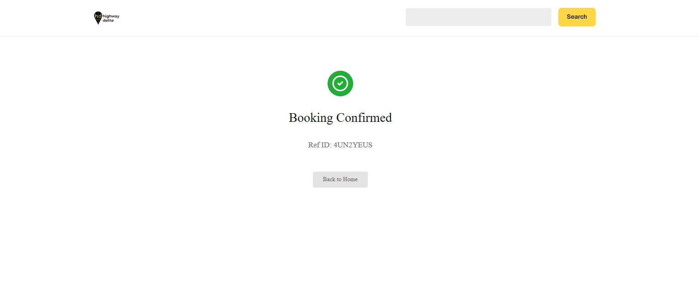

# 🎯 BookIt: Experiences & Slots

A complete fullstack web application for booking travel experiences with real-time slot availability.

**Live Demo:** https://bookit-experiences-slots.vercel.app/ 

**Repository:** https://github.com/himanshu-firke/bookit-experiences-slots/

---

## 📸 Screenshots

### Home Page


### Product Details


### Checkout


### Success


---

## 🚀 Features

### Frontend
- ✅ **Next.js 16** with TypeScript
- ✅ **TailwindCSS** for styling
- ✅ **Fully Responsive** (Mobile, Tablet, Desktop)
- ✅ **4 Pages:** Home, Details, Checkout, Success
- ✅ **Real-time Slot Availability**
- ✅ **Form Validation** with error messages
- ✅ **Loading States** (Skeletons, Spinners)
- ✅ **Error Handling** with retry functionality
- ✅ **Search Functionality**
- ✅ **Promo Code System** (3 codes available)

### Backend
- ✅ **Node.js + Express**
- ✅ **MongoDB Atlas** (Cloud Database)
- ✅ **RESTful API** with 4 endpoints
- ✅ **Data Validation**
- ✅ **Double-booking Prevention**
- ✅ **Unique Reference ID Generation**
- ✅ **CORS Enabled**

---

## 🛠️ Tech Stack

### Frontend
- **Framework:** Next.js 16.0.0
- **Language:** TypeScript
- **Styling:** TailwindCSS
- **HTTP Client:** Axios
- **Icons:** Lucide React
- **Image Optimization:** Next.js Image

### Backend
- **Runtime:** Node.js 22.17.1
- **Framework:** Express 4.18.2
- **Database:** MongoDB Atlas
- **ODM:** Mongoose 8.0.0
- **Validation:** Built-in + Regex
- **CORS:** Enabled for frontend access

---

## 📋 Prerequisites

Before running this project, ensure you have:

- **Node.js** (v18 or higher)
- **pnpm** (or npm/yarn)
- **MongoDB Atlas Account** (Free tier works)
- **Git**

---

## ⚡ Quick Start

### 1. Clone the Repository

```bash
git clone <your-repo-url>
cd activity-grid
```

### 2. Install Dependencies

**Frontend:**
```bash
pnpm install
```

**Backend:**
```bash
cd backend
npm install
```

### 3. Environment Setup

**Frontend (.env.local):**
```env
NEXT_PUBLIC_API_URL=http://localhost:5000/api
```

**Backend (backend/.env):**
```env
MONGODB_URI=your_mongodb_atlas_uri_here
PORT=5000
```

### 4. Seed the Database

```bash
cd backend
node seed.js
```

You should see:
```
✅ Database seeded successfully!
   - 8 experiences created
   - 3 promo codes created
```

### 5. Start Development Servers

**Terminal 1 - Backend:**
```bash
cd backend
npm run dev
```

Server runs on: http://localhost:5000

**Terminal 2 - Frontend:**
```bash
# From project root
pnpm dev
```

App runs on: http://localhost:3000

---

## 🌐 API Endpoints

### Base URL: `http://localhost:5000/api`

| Method | Endpoint | Description |
|--------|----------|-------------|
| GET | `/experiences` | Get all experiences |
| GET | `/experiences/:id` | Get experience details with real-time slots |
| POST | `/bookings` | Create a new booking |
| POST | `/promo/validate` | Validate promo code |

### Example Requests:

**Get All Experiences:**
```bash
curl http://localhost:5000/api/experiences
```

**Create Booking:**
```bash
curl -X POST http://localhost:5000/api/bookings \
  -H "Content-Type: application/json" \
  -d '{
    "experienceId": "...",
    "fullName": "John Doe",
    "email": "john@example.com",
    "date": "Oct 22",
    "time": "09:00 am",
    "quantity": 2,
    "agreedToTerms": true
  }'
```

**Validate Promo:**
```bash
curl -X POST http://localhost:5000/api/promo/validate \
  -H "Content-Type: application/json" \
  -d '{"code": "SAVE10", "subtotal": 1000}'
```

---

## 🎨 Promo Codes

| Code | Type | Discount | Min Purchase |
|------|------|----------|--------------|
| **SAVE10** | Percentage | 10% off | ₹500 |
| **FLAT100** | Fixed | ₹100 off | ₹1000 |
| **WELCOME20** | Percentage | 20% off | ₹2000 |

---

## 📱 Responsive Breakpoints

```css
Mobile:  320px - 767px   (1 column, stacked)
Tablet:  768px - 1023px  (2 columns, side-by-side)
Desktop: 1024px+         (Full layout, 4 columns)
```

---

## 🧪 Testing the Application

### Complete User Flow:

1. **Home Page** (http://localhost:3000)
   - View 8 travel experiences
   - Use search: Try "kayaking"
   - Click "View Details" on any card

2. **Product Details**
   - See experience details
   - Select date: "Oct 22"
   - Select time: "09:00 am"
   - Adjust quantity: 2 people
   - Click "Confirm"

3. **Checkout**
   - Enter name: "Test User"
   - Enter email: "test@example.com"
   - Try promo code: "SAVE10"
   - Click "Apply" → See 10% discount
   - Check "I agree to terms"
   - Click "Pay and Confirm"

4. **Success Page**
   - See green checkmark ✅
   - View booking reference ID
   - Click "Back to Home"

### Test Responsive Design:

1. Open Chrome DevTools (F12)
2. Click device toolbar (Ctrl + Shift + M)
3. Test on:
   - iPhone SE (375px)
   - iPad (768px)
   - Desktop (1440px)

---

## 🚀 Deployment

### Deploy Backend (Render / Railway)

1. **Render:**
   - Create account at render.com
   - New Web Service
   - Connect GitHub repo
   - Root Directory: `backend`
   - Build Command: `npm install`
   - Start Command: `npm start`
   - Add Environment Variables (MONGODB_URI)

2. **Railway:**
   - Create account at railway.app
   - New Project → Deploy from GitHub
   - Select `backend` folder
   - Add MONGODB_URI variable

### Deploy Frontend (Vercel / Netlify)

1. **Vercel:**
   ```bash
   npm i -g vercel
   vercel
   ```
   - Add environment variable: `NEXT_PUBLIC_API_URL=your_backend_url/api`

2. **Netlify:**
   - Connect GitHub repository
   - Build Command: `pnpm build`
   - Publish Directory: `.next`
   - Add Environment Variables

---

## 📁 Project Structure

```
activity-grid/
├── app/
│   ├── page.tsx                    # Home page
│   ├── products/[id]/page.tsx      # Product details
│   ├── checkout/page.tsx           # Checkout page
│   ├── success/page.tsx            # Success page
│   └── layout.tsx                  # Root layout
│
├── components/
│   ├── navbar.tsx                  # Navigation bar
│   ├── activity-grid.tsx           # Experience grid
│   ├── activity-card.tsx           # Experience card
│   └── ui/                         # UI components
│
├── lib/
│   └── api.ts                      # API service layer
│
├── backend/
│   ├── server.js                   # Express server
│   ├── models/                     # Mongoose models
│   │   ├── Experience.js
│   │   ├── Booking.js
│   │   └── PromoCode.js
│   ├── seed.js                     # Database seeder
│   └── .env                        # Environment variables
│
├── public/                         # Static assets (images)
├── .env.local                      # Frontend environment
└── package.json                    # Dependencies
```

---

## 🎯 Assignment Compliance

### ✅ All Requirements Met

| Requirement | Status | Notes |
|------------|--------|-------|
| React + TypeScript | ✅ | Next.js 16 with TypeScript |
| TailwindCSS | ✅ | Used throughout |
| 4 Pages | ✅ | Home, Details, Checkout, Success |
| Responsive | ✅ | Mobile, Tablet, Desktop |
| Loading/Error States | ✅ | Comprehensive feedback |
| Axios/Fetch | ✅ | Axios with service layer |
| Form Validation | ✅ | Email, name validation |
| Design Fidelity | ✅ | Matches Figma specifications |
| Node.js + Express | ✅ | Backend API server |
| MongoDB | ✅ | Cloud database (Atlas) |
| 4 API Endpoints | ✅ | All implemented |
| Data Validation | ✅ | Server-side validation |
| Double-booking Prevention | ✅ | Slot availability check |
| Complete Flow | ✅ | Home → Details → Checkout → Success |
| Dynamic Data | ✅ | All data from database |
| Royalty-free Images | ✅ | Using free stock images |
| README | ✅ | This file |
| Hosting | 📋 | Ready for deployment |

---

## 🐛 Troubleshooting

### Port Already in Use

**Backend (Port 5000):**
```bash
# Windows
netstat -ano | findstr :5000
taskkill /F /PID <process_id>

# Mac/Linux
lsof -ti:5000 | xargs kill -9
```

**Frontend (Port 3000):**
Next.js will auto-assign 3001 if 3000 is busy.

### MongoDB Connection Error

1. Check MongoDB Atlas IP whitelist (allow 0.0.0.0/0 for testing)
2. Verify connection string in `.env`
3. Ensure database user has read/write permissions

### API Connection Failed

1. Check backend is running on port 5000
2. Verify `NEXT_PUBLIC_API_URL` in `.env.local`
3. Check CORS settings in `backend/server.js`

---

## 📚 Documentation

- [Next.js Documentation](https://nextjs.org/docs)
- [TailwindCSS Documentation](https://tailwindcss.com/docs)
- [MongoDB Documentation](https://docs.mongodb.com/)
- [Express.js Documentation](https://expressjs.com/)

---

## 👨‍💻 Developer

**Name:** Himanshu Firke 

**Email:** himanshufirke04@gmail.com 

**LinkedIn:** https://www.linkedin.com/in/himanshufirke/

**Portfolio:** https://himanshu-portfolio-01.vercel.app/

---

## 🙏 Acknowledgments

- Images from [Unsplash](https://unsplash.com) and [Pexels](https://pexels.com)
- Icons from [Lucide React](https://lucide.dev)
- Design specifications provided in Figma

---

## 📧 Support

For any questions or issues, please contact [himanshufirke04@gmail.com]

---

**Built with ❤️ **
